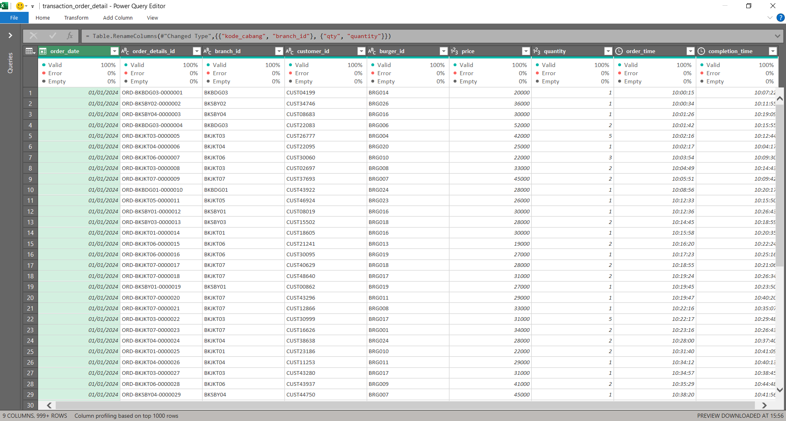
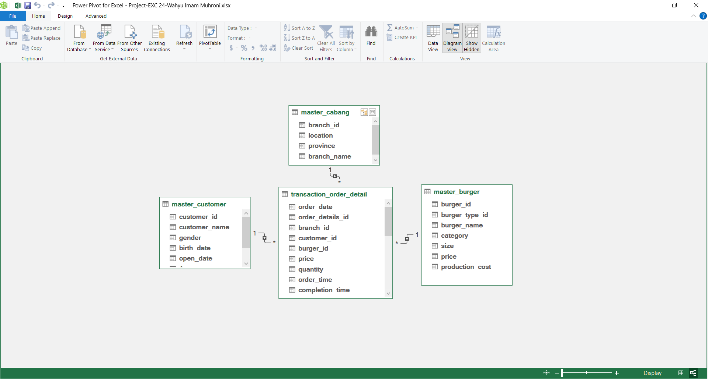
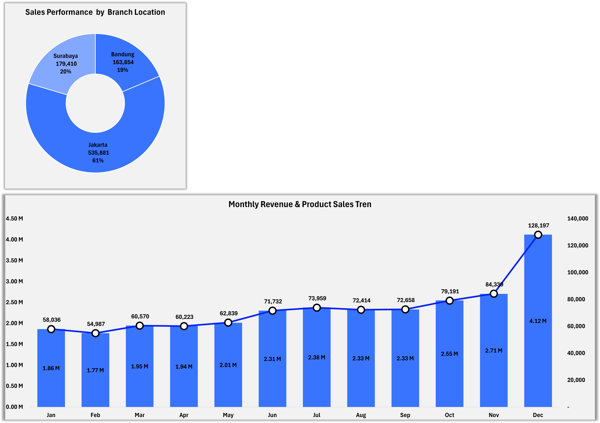
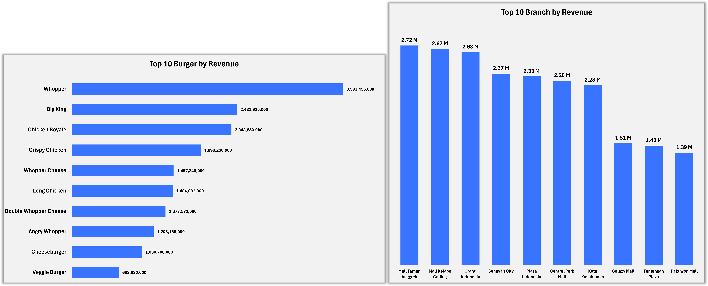
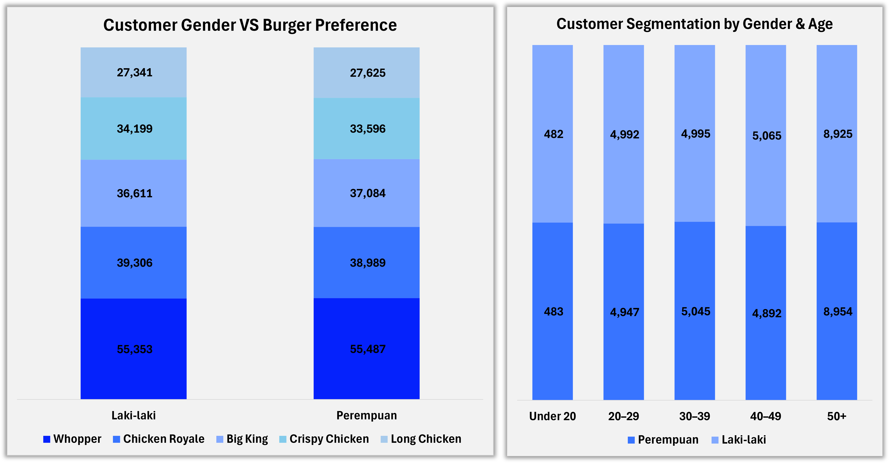
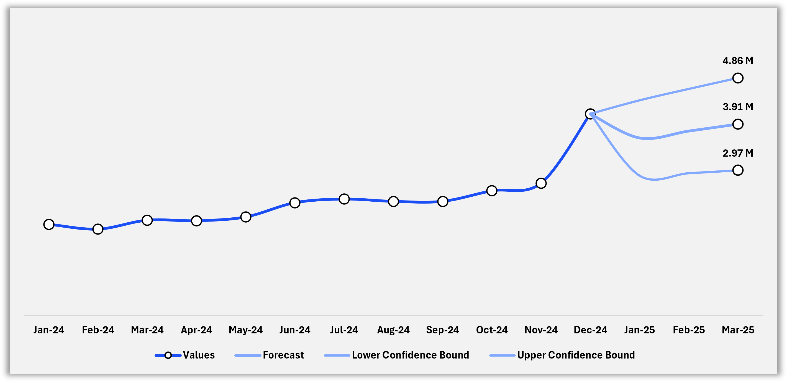

# Burger Krave Sales Performance Analysis

An end-to-end sales analytics project developed using **Microsoft Excel, Power Query, and Power Pivot** to analyze Burger Krave's sales performance, profitability, customer behavior, product performance, branch contribution, and short-term revenue outlook.

The project covers the complete analytics workflow from data preparation and relational data modeling to KPI development, interactive dashboard creation, and three-month revenue forecasting.

---

## Project Overview

Burger Krave operates across multiple branches and offers various burger products across different categories and sizes.

This project analyzes transaction data throughout **2024** to understand overall business performance, identify key revenue drivers, evaluate customer characteristics, compare branch performance, and monitor sales trends.

The analysis was developed using:

- Microsoft Excel
- Power Query
- Power Pivot
- Data Model Relationships
- Measures
- PivotTables
- PivotCharts
- Slicers
- Forecasting Tools

---

## Business Objectives

The project aims to answer several business questions:

- How did overall revenue and profitability perform throughout 2024?
- Which burger products generated the highest revenue?
- Which branches contributed the most to total revenue?
- How is sales activity distributed across branch locations?
- What are the purchasing preferences of male and female customers?
- How are customers distributed across different age groups?
- How did monthly revenue and product sales develop throughout the year?
- What is the estimated revenue outlook for the next three months?

---

# Dataset

The analysis uses four related datasets.

| Dataset | Description |
|---|---|
| `transaction_order_detail` | Transaction date, order ID, branch, customer, burger, price, quantity, order time, and completion time |
| `master_customer` | Customer ID, customer name, gender, birth date, and account opening date |
| `master_cabang` | Branch ID, location, province, and branch name |
| `master_burger` | Burger ID, burger type, burger name, category, size, price, and production cost |

The `transaction_order_detail` table serves as the main transaction table, while the remaining tables provide descriptive customer, branch, and product information.

---

# Analysis Workflow

```text
Raw Dataset
    ↓
Power Query
Data Cleaning & Transformation
    ↓
Power Pivot
Data Modeling & Relationships
    ↓
Measures & KPI Development
    ↓
PivotTables & PivotCharts
    ↓
Interactive Dashboard
    ↓
Business Insights
    ↓
Three-Month Revenue Forecast```
```

---

## Data Preparation with Power Query

Power Query was used to prepare and standardize the datasets before analysis.

The preparation process included:

- Standardizing column names
- Assigning appropriate data types
- Validating missing and error values
- Preparing primary and foreign keys
- Structuring transaction and master data
- Preparing analysis-ready tables
- Ensuring consistency between related datasets



---

## Power Pivot

### Data Modeling

After data preparation, the cleaned tables were loaded into the Power Pivot Data Model.

The model uses transaction_order_detail as the central transaction table connected to three supporting master tables.

Table Relationships



- `master_customer[customer_id]` → `transaction_order_detail[customer_id]`
- `master_cabang[branch_id]` → `transaction_order_detail[branch_id]`
- `master_burger[burger_id]` → `transaction_order_detail[burger_id]`

### Measures

Several measures were created in Power Pivot to support KPI calculation and dashboard analysis

| Measure              | Analytical Purpose                                 |
| -------------------- | -------------------------------------------------- |
| Revenue Per Trx      | Supports revenue calculation from transaction data |
| Profit               | Measures overall business profit                   |
| Customer Count       | Measures the number of customers                   |
| Profit Margin %      | Evaluates profitability relative to revenue        |
| Avg Completion Order | Measures average order completion performance      |

### DAX Code

```DAX
Revenue Per Trx

Revenue Per Trx :=
SUMX(
    'transaction_order_detail',
    'transaction_order_detail'[quantity]
        * RELATED(master_burger[price])
)
--------------------------------------------------------------------------

Profit

Profit :=
SUMX(
    transaction_order_detail,
    (
        RELATED(master_burger[price])
        - RELATED(master_burger[production_cost])
    )
    * transaction_order_detail[quantity]
)
--------------------------------------------------------------------------

Customer Count

Customer Count :=
DISTINCTCOUNT(
    transaction_order_detail[customer_id]
)
--------------------------------------------------------------------------

Profit Margin %

Profit Margin % :=
DIVIDE(
    [Profit],
    [Revenue Per Trx],
    0
)
--------------------------------------------------------------------------

Avg Completion Order

Avg Completion Order :=
AVERAGEX(
    FILTER(
        transaction_order_detail,
        NOT(ISBLANK(transaction_order_detail[order_time]))
            && NOT(ISBLANK(transaction_order_detail[completion_time]))
    ),
    MOD(
        transaction_order_detail[completion_time]
            - transaction_order_detail[order_time],
        1
    ) * 1440
)```
```

---

## Dashboard Overview

An interactive Excel dashboard was developed to summarize the main business indicators and provide multiple perspectives on sales performance.

The dashboard includes interactive filters for:

- Transaction Period
- Burger Category
- Burger Name
- Branch Name

Executive KPIs

| KPI             |         Result |
| --------------- | -------------: |
| Total Revenue   | 28,263,267,000 |
| Total Customers |         48,780 |
| Total Orders    |        500,000 |
| Total Quantity  |        879,145 |
| Total Profit    | 16,195,231,700 |
| Profit Margin   |         57.30% |


---

## Sales Performance Analysis

Monthly revenue showed an overall upward trend throughout 2024.

Revenue increased from approximately 1.86 billion in January to approximately 4.12 billion in December.

Product sales volume also increased toward the end of the year, reaching approximately 128K units in December.

Branch Location Performance

Sales activity was concentrated across three primary locations:

- Jakarta
- Surabaya
- Bandung

Jakarta represented the largest share of sales activity among the analyzed branch locations.



---

## Product & Branch Performance

### Product Performance

Whopper generated the highest revenue among the analyzed Burger Krave products at approximately 3.99 billion.

Other major revenue contributors included:

- Big King
- Chicken Royale
- Crispy Chicken
- Whopper Cheese

This indicates that a relatively small group of products contributes a significant share of overall product revenue.

### Branch Performance

Mall Taman Anggrek recorded the highest branch revenue at approximately 2.72 billion.

Other leading branches included:

- Mall Kelapa Gading
- Grand Indonesia
- Senayan City
- Plaza Indonesia
- Central Park Mall
- Kota Kasablanka

These branches represent important contributors to Burger Krave's overall sales performance.



---

## Customer Analysis

Customer analysis was conducted from both gender and age perspectives.

### Burger Preference by Gender

Burger preferences were relatively balanced between male and female customers across several leading products, including:

- Whopper
- Chicken Royale
- Big King
- Crispy Chicken
- Long Chicken

## Customer Segmentation by Age

Customers were grouped into:

- Under 20
- 20–29
- 30–39
- 40–49
- 50+

The 50+ segment represents the largest age group in the customer segmentation analysis.

Gender distribution within the age groups also appears relatively balanced.



---

## Three-Month Revenue Forecast

A three-month revenue forecast was created using historical monthly revenue patterns to estimate potential performance for:

- January 2025
- February 2025
- March 2025

The forecast visualization includes:

- Historical values
- Forecast values
- Lower confidence bound
- Upper confidence bound

The inclusion of confidence bounds highlights the uncertainty associated with future revenue estimates.

Forecast values are estimates based on historical patterns and should not be interpreted as guaranteed future results.



---

## Key Insights

- Burger Krave generated approximately 28.26 billion in total revenue during the analyzed period.
- Total profit reached approximately 16.20 billion, with a 57.30% profit margin.
- Revenue demonstrated an overall upward trend throughout 2024.
- December recorded the highest monthly revenue at approximately 4.12 billion.
- Whopper was the highest revenue-generating burger product.
- Mall Taman Anggrek was the highest revenue-generating branch.
- Jakarta represented the largest share of sales activity among the analyzed locations.
- Customer burger preferences were relatively balanced between male and female customers.
- The 50+ age segment represented the largest customer segment.
- Historical revenue trends support a positive short-term revenue outlook, although forecast values remain subject to uncertainty.

---

## Business Recommendations

1. Maintain High-Performing Product Availability

High-revenue products such as Whopper, Big King, and Chicken Royale should receive strong inventory and availability support.

Product performance can also be used to prioritize promotional campaigns and menu placement.

2. Use High-Performing Branches as Benchmarks

Branches such as Mall Taman Anggrek, Mall Kelapa Gading, and Grand Indonesia can be studied as performance benchmarks.

Operational or commercial practices from stronger branches may provide useful insights for lower-performing locations.

3. Prepare Capacity for High-Demand Periods

The increase in revenue and product sales toward the end of the year indicates the importance of preparing:

- Inventory
- Staffing
- Production capacity
- Operational resources

for periods of stronger demand.

4. Develop Customer-Based Marketing Strategies

Customer segmentation by age and gender can support more targeted promotional strategies.

The relatively large 50+ customer segment may represent an opportunity for more tailored product communication or loyalty initiatives.

5. Monitor Revenue Forecast Against Actual Performance

Forecast results should be compared with actual revenue each month.

Updating the forecast as new transaction data becomes available can improve future planning and help management respond to changing sales patterns.

---

## Skills Demonstrated

**Microsoft Excel • Power Query • Power Pivot • Data Cleaning • Data Transformation • Data Modeling • Table Relationships • Measures • PivotTables • PivotCharts • KPI Analysis • Sales Analysis • Product Analysis • Branch Analysis • Customer Segmentation • Dashboard Development • Revenue Forecasting • Business Insights • Data Storytelling**

---

## Project Structure

```text
burger-krave-sales-analysis/
│
├── README.md
│
├── excel/
│   ├── README.md
│   └── burger_krave_sales_analysis.xlsx
│
└── images/
    ├── README.md
    ├── 01_dashboard_overview.png
    ├── 02_sales_performance.png
    ├── 03_product_and_branch_performance.png
    ├── 04_customer_segmentation.png
    ├── 05_power_query_data_preparation.png
    ├── 06_three_month_revenue_forecast.png
    └── 07_data_modeling.png
